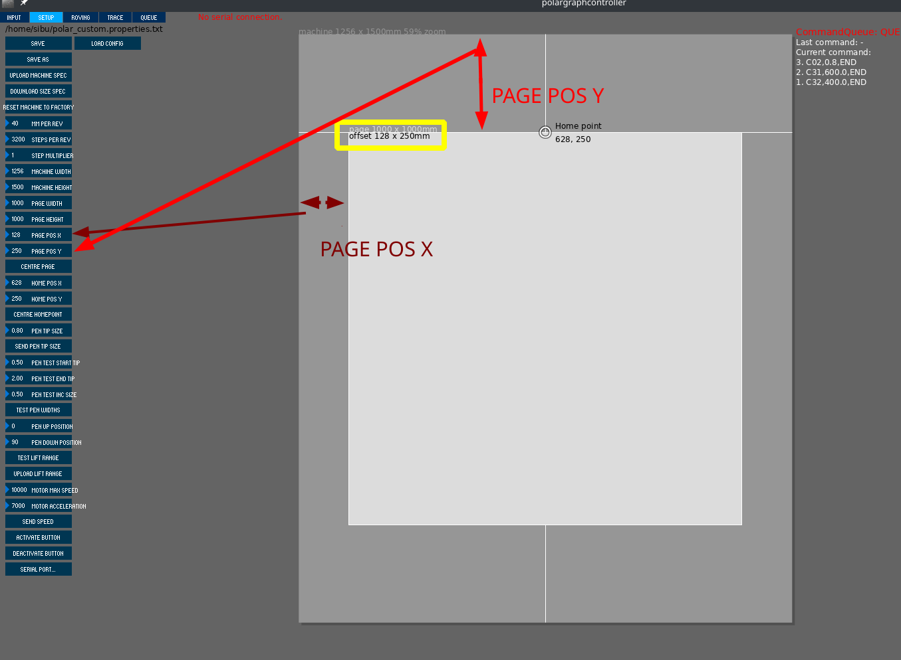
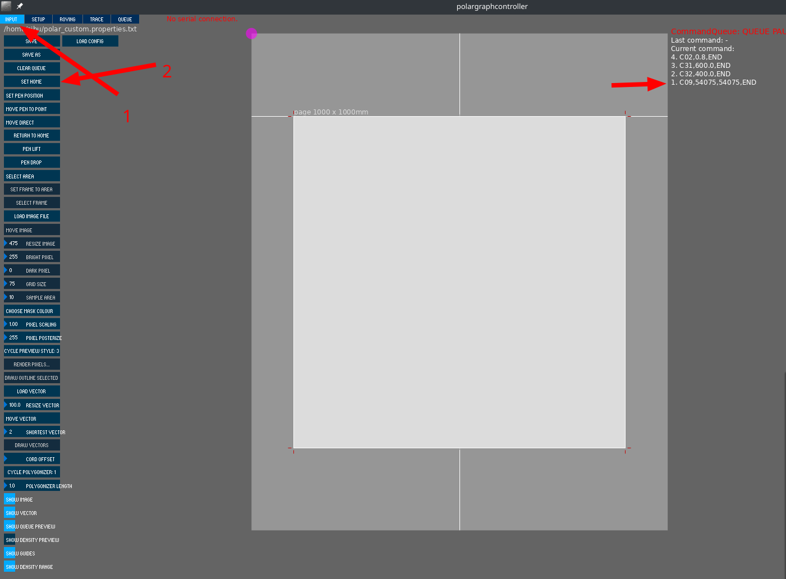

# Machines for Learning : The Wall Plotter
### **[Funded by The Hamdan Foundation, UAE](http://www.ha.ae/en/web/guest/home)**

During FAB15, 12 machines were built by the FabLab community and donated to 12 schools in Egypt. We made 
- 2 x mini CNC mill
- 5 x 3D printer
- 5 x Wall Plotter
  
The project was Funded by **[The Hamdan Foundation, UAE](http://www.ha.ae/en/web/guest/home)**.

The wall plotter design is mostly based on the [PolarGraph](http://www.polargraph.co.uk) machine. Here we document the slight differences in the design, the assembly instruction, software setup, calibration steps and other trouble shooting steps.

The machine was delivered in fully assembled and in fully working condition. Also the machine is very simple in terms of mechanical complexity. Which means detailed assembly instruction won't be necessary, as it is very trivial once the machine is in hand. The end users are supposed to hack these machines, modify, redesign..., so, we have provided some crucial information to help the end user do so. 


# Hardware

## BOM

The BOM is only for assembly, the end user do not need these as they already got the machine fully assembled.

- 2 x Nema 17 Bi-Stepper Motors 12v
- GT2 Timing belt, length depends on the machine dimension
- GT2 Pulley
- 1 x 9g 0-180 degree  Servo Motor, 
- 1 x Arduino Uno
- 1 x [CNC-Shield v3](https://blog.protoneer.co.nz/arduino-cnc-shield)
- 2 x Pololu, step-dir stepper driver or compatible
- A few jumpers (not wires), usually comes with stepper driver or CNC-shield
- 1 x 12v Power supply and 3-core power cable  
- Sufficient length of quality wire for 12v DC
- Wires for extending the stepper and servo motors.
- .
- m3,m4 and m6 nuts, washers and bolts of various lengths
- m15 washers or bolts or something similar to use as weights.
- zip-ties
- 3-5mm plywood sheet for laser cutting
- 12mm or more thick plywood/MDF sheet or similar. Dimension corresponds to the dimension of the final machine.
- Access to a 3D printer as there are a few 3D printed parts- 

## Mechanical Assembly 
- **Mounting the timing belt to the gondola :** The timing belt has to be attached with the Gondola by pinching the belt between the pen-holder (it has a small tooth corresponding to the timing belt tooth) and a small securing laser-cut retainer.
  - **The retainer** 
  - **The tooth on the pen holder** 
  
- **Mounting the stepper motor :**  The stepper motor is mounted on a laser cut plywood. This assembly then goes onto the MDF/Plywood panel(used as the drawing board). 
  - If the laser cut plates are too flimsy, you may stack two of them.

  - The motor, in our case, is mounted to the plate using **m3** screws. It is recommended to use m3 washer, especially if you use soft plywood for the stepper mount plate.
  
  - The plate is then mounted to the big board using m5/m6 bolts, washers on both sided and nuts. 
  
  - There are alignment guides on the plates, there is a tiny hole to locate the corner of the board. Align this hole to the corner of the board. See the picture below.
  - 
  
  - Then there are two right angle cuts, align these to the board edges. With these done, clamp the plate and drill the mounting holes on  the board. See the picture above.
  
- **Mounting the servo motor :**  The servo motor mount is designed to be used with small zip-ties. There are two sets of mounting holes. 
- 
  - The arm used is the single cam type.
  -  

  - **Mounting the servo arm** : Assuming that you have a 0-180 servo, not the continues rotation type. Connect the machine and do 'PEN-UP', at this position the arm should be mounted such that the arm touches the paper, raising the pen so that it doesn't touch the paper.  

  - If you have different types of servos you will have to play around and find the correct values for the PEN-UP and PEN-DOWN and edit the configuration file.

- **Attaching the counterweights :** There are three weights on the system. Two on either side. And one on the GOndola itself. 
  - The quick and dirty(and cheap) way I found to make a tunable counterweight is those 500ml water-bottles. The amount of the water tunes the weight. These are only for the ones on the side.

  - This can be done by making a small slit (with a sharp blade of course) on the cap, and inserting the timing belt through it. It will hold on it's on if you make the slit clean and just enough for the belt to enter through.

  - For the weight on the Gondola, it is recommended to use heavy steel nuts. This is clean and compact.

  - There are three place where you can mount these nuts on the gondola. One on the bottom and two on the sides. 
  **See the picture above**   

  - The long bolts used for mounting these nuts are actually thinner (**m5** or **m6**) than the nuts itself(often **m16** and higher, as  they are heavy). Because the bolt is mounted upside down and if we use **m16** bolt the head of this bolt will be too thick for the servo arm to be able to lift the pen. You can use m16 bolts, but then you will have to use longer servo arms and tune the servo parameters.

  - To secure the **m16** nuts on the thin bolts, you may cut washers from plywood.

- **Mounting the pen :** The pen holder will have to be modified for the pen you use, or  you will have to use some sort of grippy spacers, preferably rubber. You can also use rubber bands to increase the grip on the pen. The pen has to be mounted such that the tip just lifts up when the servo arm is engaged (pen-up position). [Here is the STL of the pen holder](./files/pen_holder.stl)
- 

## Electronics 

### Connections
- 
- **Servo connection :** The servo Wire need to be extended with Flat-Flexible-Cable FFC. The servo signal wire goes to the **PIN-9** of the arduino or **x- end-stop** in the shield. 

- **Micro-Stepping :** You can enable micro-stepping (I did, 1/16) for better resolution. 
- Stepper also need to be extended, but with wires that are rated for the maximum stepper current rating. Ethernet cables are cheap and readily available option. You get four pairs of wire from an ethernet cable, enough for both of the stepper motors. 

I used X and Y ports in the shield.

### Configuration
- **Enable jumper on CNC shield :** See the picture above. 

- **Power pass through from  CNC shield to Arduino :** See the picture above. This is required as the servo is powered by the 5v rail, which in turn comes from the Arduino board. The 500mA from the USB is insufficient to power the servo too.
 
  - This can be done with a wire with a male connector in one end, which connects to the **V_mot** pin of one of the unused stepper driver slots. The other end can be soldered to the positive out of the barrel connector, before the protection circuitry in Arduino.

  - Alternatively you can also split the 12v line, use a **5.5/2.1mm** barrel connector 


# Software

All the necessary files can be found in the repository. The Micro-controller firmware and Application can be found inside this [zip file](./files/Polargraph-2017-11-01.zip).

## Firmware and Tweaks

The folder, ```arduino-source``` have the firmware source.
Open it and copy the contents of the ```libraries```  into your arduino library folder (in linux, by default it is in ~/Arduino/libraries).

Also copy the ```polargraph_server_a1``` folder into the arduino project folder (````~/Arduino```` in linux).

There are few important edits to be made. 

- ```polargraph_server_a1.ino```
  - define the microcontroller (we have an UNO)
    - uncomment ```#define MICROCONTROLLER MC_UNO``` 
  - Choose the stepper driver type (we use pololu)
    - uncomment ```#define SERIAL_STEPPER_DRIVERS```
  - Disable unused features (optional)
  - define serial speed (57600 bps by default)
  - servo pin (we used default PIN9)
    - ```const byte PEN_HEIGHT_SERVO_PIN = 9;```
- ```configuration.ino```
  - step and direction pins for the controller
    ```bash
    #ifdef SERIAL_STEPPER_DRIVERS
   
    #define MOTOR_A_ENABLE_PIN 8
    #define MOTOR_A_STEP_PIN 2
    #define MOTOR_A_DIR_PIN 5
  
    #define MOTOR_B_ENABLE_PIN 8
    #define MOTOR_B_STEP_PIN 3
    #define MOTOR_B_DIR_PIN 6
    AccelStepper motorA(1,MOTOR_A_STEP_PIN, MOTOR_A_DIR_PIN); 
    AccelStepper motorB(1,MOTOR_B_STEP_PIN, MOTOR_B_DIR_PIN); 
    #endif
    ```


## Application and configuration
There is an UI for this machine and the application can be found inside the zip. The app is written an compiled using [processing 2.2.1](https://processing.org/download/). It does not work in version 3+.

The source code and pre-compiled binaries for Linux (and Windows, but I haven't tested this) are also provided in the zip.

The controller directory inside the zip have the compiled binary for the UI for the machine, for linux and windows. The default configuration file is named default.properties.txt, this can be replaced with custom config file. 


### Launching application
In linux, you need to make the ```polargraphcontroller``` file located in ```Polargraph-2017-11-01/controller/application.linux64/``` executable, by

```bash
chmod +x polargraphcontroller
```
Then launch the application by
```bash
./polargraphcontroller
```

### Loading custom config file 
The text file, [polar_custom.properties.txt](./files/polar_custom.properties.txt) is the configuration file for the UI and some aspects of the machine. There is a default config file, you can either replace it with the custom config file (and rename it) or load the custom file every-time you launch the application.


        Note: Many of the machine configuration settings can be changed permanently by editing the polargraph_server_a1.ino , but still can be overridden by user configuration file. 

        Also the user configuration can be written to the micro-controller EEPROM from the application.

# Calibration and Tuning

## Calculating Steps/Rev
    Number of Steps to be sent to the step-direction based stepper controller for a full rotation of the shaft. 

This depends on the three parameters, 
- Micro-Stepping settings of the driver
- Number of full steps per rotation of the stepper motor, as specified in the motor specifications.
- Gear ratio if any

In our case we do not have any gear in the assembly, it's direct drive. So if the drivers are configured to be **1/N** Micro-Stepping, and the Motor is rated for **M** steps per rotation, 

**Steps/Rev = M x N**

    For our system this number is 200 x 16 = 3200 Steps/Rev


## Calculating mm/Rev
    This is the linear motion by the drive belt/string per rotation of the motor. In essence, it is the effective circumference of the final drive gear/pulley

For a system with timing belt,
This number depends on the number of gear pitch and number of gears on the drive pulley. 

**(Pitch) x (Number of gear on the drive gear)**

    For our system, we are using a 20 tooth GT2 pulley to drive the GT2 belt, so, this number is 20 x 2 = 40mm/Rev

 
 You can change the defaults in the configuration file.

## Max speed and acceleration 
The max speed and acceleration is to be found out by the user and it varies from machine to machine. It depends on several factors like, 

- The Torque rating of the motor

- Power-supply 

  - supplying 12v to to a 24v rated motor won't give you the ideal performance

- Stepper motor controller

- Micro-stepping configuration

- The tensioning weights used 

  - more weight means less acceleration for a given torque
  
  - but, less weight will make the belt slip from the gear
  
  - less weight also means less pen force.

These parameters can be found by trial and error. The crude way os to find the settings at which it fails and turn it down a bit.

 

## Setting zero

**This could be the most crucial step of the entire assembly.** Where you set the origin in the machine is super important in polar machines to make the machine where move the way you want. Read the note below to understand why.

    Note: The important thing to understand is that the machine is working in polar coordinates. 
    
    Let's call 
    - X and Y as the machine head position.
    - dx and dy as the change in X and Y we need
    - m1 and m2 as the rotation in motor 1 and 2 to make the change dx and dy.
    
    In traditional cartesian coordinates, no matter where your head is at you can ask the machine to move dx and dy and it will move exactly dx and dy. In a way in cartesian machines the motion of the head is only a function of the motion of the motor shafts, m1 and m2 and not the current positions itself.

    Even in unconventional cartesian machines like H-bot or CORE-XY, the dx and dy is only a function of m1 and m2.

    dx,dy = f(m1,m2)

    But for polar machines like this. dx and dy is a function of m1,m2,X and Y

    dx,dy = f(m1,m2,X,Y)

As you see in the note above, in this machine calibration is extremely important, else you will get a distorted drawing. For example, you may want to draw a square and if your calibration is wrong, you may end up with some wired shape with curved edges.

There are few measurements and configuration settings you have to do before setting zero.

We need to measure the 
- **Machine dimension (Width and Height) :**  
  - **The width** of the machine is measured from the left anchor point of the belt to the right anchor point of the belt. we can approximate this by **shaft to shaft** length. 
    - 

  - The height of the machine is not that critical, means it doesn't affect the performance of the machine. But set it as the height of the MDF/Plywood drawing platform.

- **Page Dimensions :** This is the WIdth and Height of the page/paper in which we are drawing. 
  - 

- **Page position :** This is the XY offset of the page with respect to the top left motor shaft. Try to keep the page centered in X. For Y, keep it slightly below the Y=0 line (line connecting shaft to shaft), otherwise the machine will have to generate very high tension to raise the pen to the top of the page and  this will most likely result in slippage of the belt from pulley and loose calibration.
  - 

The way I do the calibration is to choose a point, half of the width of the machine/board and at the top of the drawing area. Permanently mark this spot on the board with a tiny hole or a screw or something. Measure this point with the top left motor shaft as the origin. 
 

- The HOME_POINT Y is same as the PAGE_OFFSET is you do it right. 
- The HOME_POINT X is Machine_Width / 2 
  
- Now, to actually set the Home, 
    - disable the power to the stepper, 
    - click set home, the motors will not move, but the machine will assume that it moved to HOME_POINT.
    - bring the machine manually to the HOME_POINT and engage the power to the stepper.
    - 

# Draw
Now we are done with the hard part. Load a vector and draw. 

- Load vector with the LOAD_VECTOR button
- Move vector by clicking MOVE_VECTOR button and then dragging the center of the vector where you want it.
- Scale the vector by **moving the mouse up or down while clicking and holding the SCALE_VECTOR button**.
 

# References 

## All mechanical CAD was made by OnShape and the are [available HERE](https://cad.onshape.com/documents/d169351ce7a3db9697c065e0/w/642eb27db53fa1065eb8dde2/e/45781a3c8a8712fb6f7df40b)

- [PolarGraph](http://www.polargraph.co.uk) website
- [Polargraph Wiki](https://github.com/euphy/polargraph/wiki)
- [CNC-shield](https://blog.protoneer.co.nz/arduino-cnc-shield/)
- [An inscrutable article](https://www.instructables.com/id/Polargraph-Drawing-Machine/)


#
#
#


# Limitations and improvements to be made

- Gondola and pen holder
  - The current design is only compatible with one type of pen. There are better designs using more expensive or difficult or get parts. But they may perform better.
- End-stops (Most plotters like this does not have end stops and homing, but it should be doable with a little modification to the firmware)
- Power supply upgrade or Stepper motor upgrade: 
  - The power supply was 12v, but the available stepper motors are rated for 24v. Which means we are not getting the rated torque. We should wither use 24v supply, or 12v rated motor. I recommend the later, as we are using a builtin 5v linear regulator in Arduino to generate the 5v, doing this with 24v is not efficient and safe.


